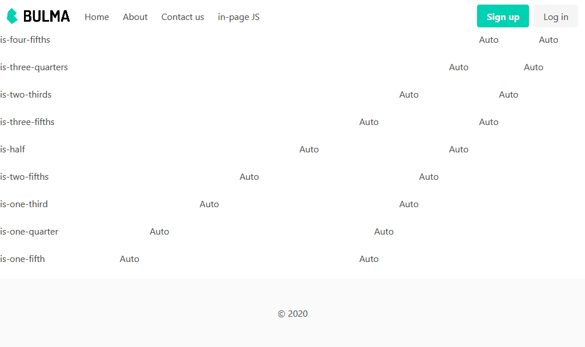

# Nunjucks Starter Kit

## Requirement
- Node: [https://nodejs.org/en/download](https://nodejs.org/en/download)

## Fork

- This is a fork from [https://github.com/wzulfikar/nunjucks-starter-kit](https://github.com/wzulfikar/nunjucks-starter-kit)
I updated all dependencies, and changed the gulp file a little.
- I swapped Bootstrap[https://getbootstrap.com/](https://getbootstrap.com/) for Bulma [bulma.io/](bulma.io/)
- I added the bulma SASS source, so  you can comment out parts you don't use, then recompile the bulma CSS file.

### How to start

1. download & unzip: [https://github.com/benninkcorien/nunjucks-starter-kit/archive/master.zip](https://github.com/benninkcorien/nunjucks-starter-kit/archive/master.zip)
- install dependencies: run `yarn install`
- run `gulp bulma` to compile bulma.css in dist/assets/css/bulma.css
- run `gulp auto` . this will launch browsersync and watch for changes etc.
- try change something inside `src/pages` & your browser will auto-reload, displaying the change you just made.

See YouTube video: [https://youtu.be/H7_yhCvQJDk](https://youtu.be/H7_yhCvQJDk)

> *Run `gulp minify` if you want to minify your html files inside `dist` folder*

---

# Why?
- works out of the box! 
- example included (using bulma css): 
  - `src/pages` for page content
  - `src/templates` for page layout
- output is plain html (stored in `dist` directory)
- serverless
- can use free service like surge.sh, github pages for hosting
- minimum knowledge needed: html, css, js – no need for php, ruby, etc.
- minifier included! use `gulp minify`

## Directory Layout
Here is the project structure:

- `dist` : this directory contains real files that will be hosted
- `dist/assets` : all css, js, images, fonts and whatever assets related to app are located here
- `src` : raw files used to develop the app
- `src/pages` : pages for the app, everything here will be rendered to `dist` directory
- `src/templates` : layout files
- `src/templates/partials` : partial files like nav, user-tabs, menu, etc

## Sample workflow
A. without auto-render

1. edit pages in src
- run `gulp`
- publish `dist` to hosting provider

B. with auto-render

1. run `gulp watch`
- as you edit src, dist gulp watch will do the rendering behind the scene n updates dist directory: you need to reload your browser to see the changes
- publish dist to hosting provider

C. with auto-render & auto-reload (via browsersync)

1. run `gulp auto`
- it will open `http://localhost:3000` in your browser
- using this workflow, when you edit `src` the `dist` will be updated (just like workflow B) and your browser (`http://localhost:3000`) will be reloaded automatically.

## Page variables

used in <title> tag

### set active menu item
thenav.active('pagename')


    
    {{ thenav.active('about')}}


---

Nunjucks official docs: [https://mozilla.github.io/nunjucks]([https://mozilla.github.io/nunjucks)
